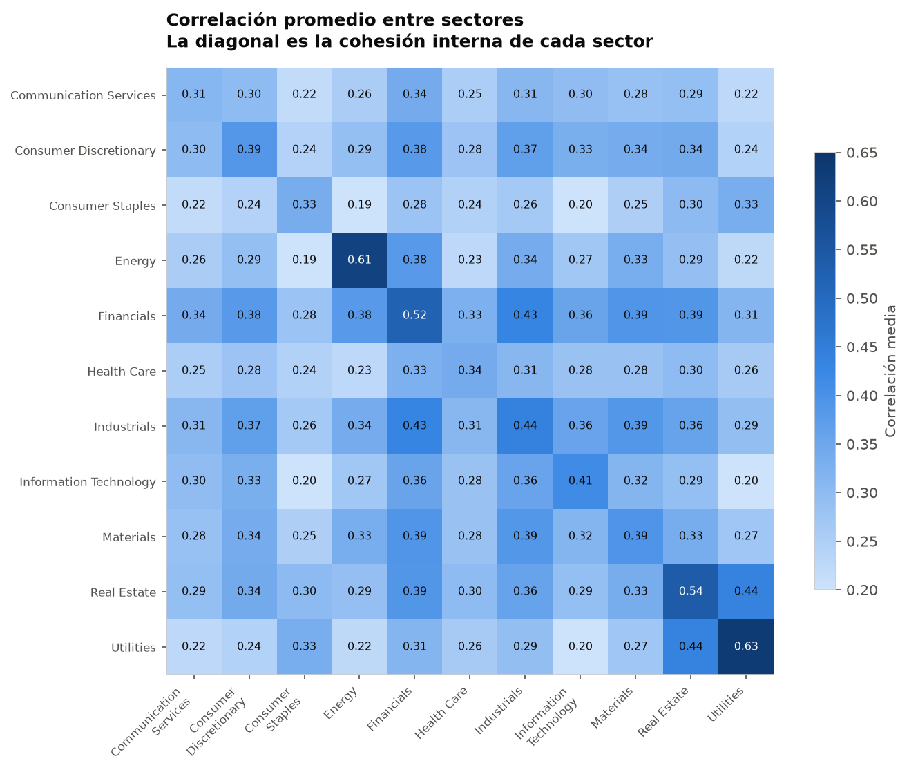
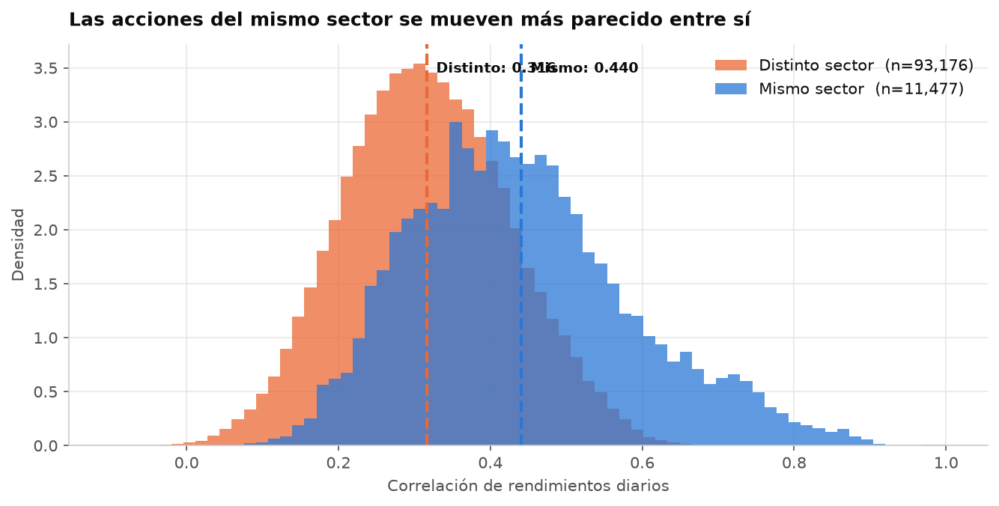

# Correlación entre acciones del S&P 500

Motor de análisis de estructura de correlación y riesgo para los componentes del S&P 500,
inspirado en la capa analítica de plataformas de gestión de riesgo como Aladdin (BlackRock).

**Materia:** Datos Masivos · **Entregable 1** — Definición del problema, fuentes de datos y
repositorio reproducible

---

## El problema

Cuando se construye un portafolio, el riesgo total **no es la suma de los riesgos individuales**:
depende de cómo se mueven los activos entre sí. Dos acciones que suben y bajan al mismo tiempo no
diversifican nada — es como tener una sola posición del doble de tamaño.

Con 500 acciones hay **más de 124,000 pares** que evaluar, y el número crece con el cuadrado del
universo. Medir esa estructura de co-movimiento, y entender de dónde viene, es el problema central
de la gestión de riesgo cuantitativa.

### Pregunta de este entregable

> **¿Las acciones del mismo sector GICS están más correlacionadas entre sí que con acciones de
> otros sectores, y qué tan grande es esa diferencia?**

---

## Hallazgos

**Sí, y la diferencia es sustancial.**

| Grupo | Pares | Correlación media |
|---|---|---|
| **Mismo sector** | 11,477 | **0.440** |
| **Distinto sector** | 93,176 | **0.316** |

El co-movimiento dentro de un sector es **1.39 veces** el que hay entre sectores distintos, medido
sobre 104,653 pares únicos y 11.6 años de rendimientos diarios.



**Lo que valida el resultado.** Los pares con mayor correlación son exactamente los que deberían
ser: `GOOG`–`GOOGL` (0.995) y `NWS`–`NWSA` (0.972) son las dos clases de acción de la *misma
empresa*. Después vienen vínculos económicos genuinos — `AMAT`–`LRCX` (equipo para
semiconductores), `FITB`–`RF`–`CFG`–`KEY` (bancos regionales), `MET`–`PRU` (aseguradoras de vida).

**Lo más interesante está fuera de la diagonal.** *Real Estate* y *Utilities* correlacionan 0.44
entre sí, muy por encima del promedio inter-sectorial: son los dos sectores más sensibles a las
tasas de interés. La clasificación GICS los separa, pero el riesgo no.

**Lo que todavía NO se puede concluir.** La correlación cruda mezcla dos efectos: que todo el
mercado se mueve junto, y que dos empresas tienen un vínculo real. Que la correlación media *entre
sectores distintos* sea 0.32 —y no cerca de cero— es precisamente la huella de ese factor común.
Separarlos es el objetivo del Entregable 2.



---

## Fuentes de datos

Tres fuentes, **todas obtenidas mediante código**: dos por API/librería y una por scraping.

| # | Fuente | Método | Variables principales | Periodo | Formato |
|---|---|---|---|---|---|
| 1 | Yahoo Finance (`yfinance`) | Librería / API | Precio de cierre **ajustado** diario por ticker | 2015-01 → actual | JSON → DataFrame → Parquet |
| 2 | [Wikipedia — S&P 500](https://en.wikipedia.org/wiki/List_of_S%26P_500_companies) | Scraping (`requests` + `read_html`) | Ticker, empresa, sector GICS, sub-industria | Composición actual | HTML → DataFrame → Parquet |
| 3 | [FRED](https://fred.stlouisfed.org/) (Fed de St. Louis) | API REST con llave | VIX, tasa del Tesoro a 10 años | 2015-01 → actual | JSON → DataFrame → Parquet |

**Volumen procesado:** 2,934 días × 503 tickers ≈ **1.48 millones de observaciones** de precio.

---

## Cómo ejecutarlo

Requiere Python 3.11 o superior. Los cuatro comandos funcionan en cualquier computadora, sin
modificar nada: el proyecto **no contiene ninguna ruta personal**.

**1. Clonar el repositorio**

```bash
git clone https://github.com/USUARIO/datos-masivos-correlacion-sp500.git
```

**2. Entrar a la carpeta**

```bash
cd datos-masivos-correlacion-sp500
```

**3. Crear el entorno virtual e instalar las dependencias**

```bash
python3 -m venv .venv && ./.venv/bin/python -m pip install -r requirements.txt
```

**4. Abrir el notebook**

```bash
./.venv/bin/python -m jupyter lab notebooks/01_entregable1.ipynb
```

> ⚠️ **Importante: selecciona el kernel correcto.** Al abrir el notebook, elige el intérprete de
> `.venv`, no el Python del sistema ni el de Anaconda. En VS Code se hace con *Select Kernel →
> Python Environments → .venv*. Si eliges el equivocado, verás `ModuleNotFoundError: No module
> named 'yfinance'` aunque las librerías estén instaladas.
>
> Si tienes Anaconda instalado, su kernel puede tomar prioridad. Para forzar el del proyecto:
>
> ```bash
> ./.venv/bin/python -m ipykernel install --prefix=./.venv --name python3
> ```

**El notebook se ejecuta completo sin configuración adicional.** No hace falta ninguna llave de
API: `data/processed/` incluye un respaldo comprimido de los datos, y el código lo usa
automáticamente si la descarga en vivo falla.

### Opcional: datos macro frescos de FRED

FRED requiere una llave gratuita. Sin ella el notebook funciona igual (avisa y continúa).

```bash
cp .env.example .env
```

Luego abre `.env` y pega tu llave de [fredaccount.stlouisfed.org/apikeys](https://fredaccount.stlouisfed.org/apikeys).
El archivo `.env` está en `.gitignore` y **nunca debe subirse al repositorio**.

---

## Estructura del repositorio

```
datos-masivos-correlacion-sp500/
├── README.md                     Este archivo
├── requirements.txt              Dependencias con versiones fijadas
├── .env.example                  Variables de entorno necesarias (sin valores)
├── .gitignore                    Excluye .venv, .env, cachés y datos crudos
│
├── src/                          Código reutilizable
│   ├── config.py                 Rutas portables y parámetros del análisis
│   ├── data.py                   Extracción: Yahoo, Wikipedia, FRED
│   ├── quality.py                Diagnóstico: nulos, duplicados, datos corruptos
│   ├── returns.py                Precios → panel balanceado → rendimientos log
│   └── analysis.py               Correlación y agregación por sector
│
├── notebooks/
│   └── 01_entregable1.ipynb      Análisis completo con narrativa
│
├── data/
│   ├── raw/                      Caché de trabajo (ignorado por git)
│   └── processed/                Respaldo comprimido que sí viaja con el repo
│
└── figures/                      Gráficas exportadas
```

### Por qué la lógica vive en `src/` y no en el notebook

El notebook solo orquesta y narra; toda la lógica está en funciones importables. Esto tiene tres
consecuencias prácticas:

1. **El código se puede probar.** Una función con entrada y salida es testeable; una celda no.
2. **Cuatro personas pueden trabajar en paralelo.** Los archivos `.py` son texto plano y Git los
   fusiona sin problema. Un `.ipynb` es un JSON gigante donde cualquier ejecución cambia miles de
   líneas y genera conflictos irresolubles.
3. **El proyecto es acumulativo.** El Entregable 2 agrega `src/factors.py` sin tocar nada de lo
   existente.

---

## Decisiones metodológicas

| Decisión | Por qué |
|---|---|
| **Rendimientos logarítmicos, no precios** | Los precios no son estacionarios. Correlacionarlos da ~0.95 entre cualquier par de empresas que hayan subido: mide la tendencia común, no el co-movimiento |
| **Precios ajustados (`auto_adjust=True`)** | Sin ajuste, un split 4:1 aparece como una caída de −75% en un día y contamina toda la matriz |
| **Panel balanceado, mínimo 2,900 días** | En un panel balanceado la longitud la impone el ticker más joven. Exigir historia casi completa cuesta 44 empresas (9%) y multiplica por cinco la historia |
| **Sin relleno hacia adelante (`ffill`)** | Inventaría días con rendimiento 0% que nunca ocurrieron y sesgaría las correlaciones a la baja |
| **Solo el triángulo superior de la matriz** | La matriz completa cuenta cada par dos veces e incluye la diagonal (siempre 1.0), inflando los promedios |
| **`BRK.B` → `BRK-B`** | Wikipedia y Yahoo usan notaciones distintas. Sin traducir, esos tickers regresan vacíos **sin error** y desaparecen en silencio |

### Detección de datos corruptos

Se encontró un caso real: **`MNST` (Monster Beverage)** oscila entre ~\$95 y ~\$47 —exactamente la
mitad— en días sueltos de 2026, regresando después. Es un split 2:1 aplicado de forma inconsistente
por la fuente.

El criterio que lo separa de un evento real es la **frecuencia**: una empresa real tiene a lo mucho
uno o dos movimientos de ±50% en once años. `MNST` tiene siete. Casos conservados por ser reales:
`PCG` (bancarrota de PG&E, 2019), `APA`/`OXY`/`TRGP` (guerra de precios del petróleo, marzo 2020),
`GL` (reporte de vendedores en corto, 2024).

---

## Limitaciones

| Limitación | Impacto |
|---|---|
| **Sesgo de supervivencia** | Se usa la composición *actual* del índice; las empresas que quebraron o salieron no aparecen |
| **Cobertura** | 45 de 503 empresas excluidas por historia insuficiente, 1 por datos corruptos. El análisis cubre 458 |
| **Calidad de la fuente** | Yahoo Finance no es una API oficial; podría haber errores más sutiles no detectados |
| **Comparaciones múltiples** | Con 104,653 pares, cualquier prueba de significancia individual requiere corrección (Benjamini-Hochberg) |
| **Correlación ≠ causalidad** | El co-movimiento puede deberse a un tercer factor común |
| **Clases de acción duplicadas** | `GOOG`/`GOOGL` y `NWS`/`NWSA` son la misma empresa e inflan el extremo superior |

---

## Hacia dónde va el proyecto

| Entregable | Qué se agrega | Módulo nuevo |
|---|---|---|
| **1** ✅ | Extracción, diagnóstico, correlación por sector | `data`, `quality`, `returns`, `analysis` |
| **2** | PCA y modelo de factores: separar el mercado del vínculo real entre empresas | `factors.py` |
| **3** | Red de correlación: clustering jerárquico, árbol de expansión mínima, correlación móvil vs. VIX | `network.py` |
| **4** | Capa de riesgo: covarianza con shrinkage, contribución al riesgo, universo ampliado con Parquet/DuckDB | `risk.py` |

---

## Integrantes

| Nombre | Responsabilidad |
|---|---|
| _(completar)_ | Extracción y configuración (`src/data.py`, `src/config.py`) |
| _(completar)_ | Diagnóstico de calidad (`src/quality.py`) |
| _(completar)_ | Rendimientos y correlación (`src/returns.py`, `src/analysis.py`) |
| _(completar)_ | Documentación (`README.md`) |

---

> **Aviso.** Este es un proyecto académico de análisis de datos. No constituye asesoría de
> inversión ni recomendación financiera de ningún tipo.
